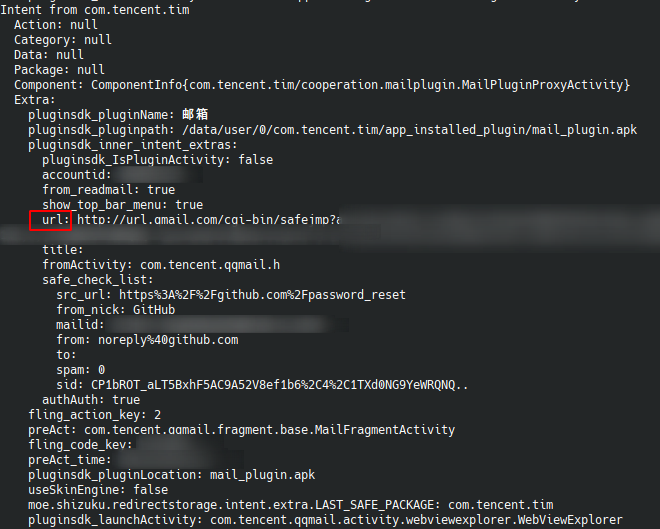

# Riru - InternalBrowserRedirect Rules

Riru - InternalBrowserRedirect 的 策略组

[English](README.md)


### Rules 仓库结构

```text
/
|--- packages.json
|--- rules
     |--- <package>.json
     |--- <package2>.json
     |--- <package3>.json
     |--- ...json
```

* packages.json - 所有的策略组的 **版本** 和 **目标包名** 将会存储在这个文件
* rules directory - 所有策略组将会存在在这个目录
* \<package\>.json - 对于 \<package\> 的 策略组


### 文件结构

#### packages.json

```json
{
	"packages": [
		{
			"packageName": "com.tencent.tim",
			"version": 2
		}
	]
}
```

* `packages` - 策略组合集
* `packageName` - 在 `rules` 目录中的 策略组 的 **目标包名 **
* `version` - 在 `rules` 目录中的 策略组 的 **版本**


#### \<package\>.json

```json
{
    "tag": "TIM",
    "authors": "Kr328",
    "rules": [
        {
            "tag": "default",
            "url-source": "intent://extra/url",
            "url-filter": {
                "ignore": ".*qq\\.com/.*",
                "force": ""
            }
        },
        {
            "tag" :"build-in QQ Mail",
            "url-source": "intent://extra/pluginsdk_inner_intent_extras/url",
            "url-filter": {
                "ignore": ".*qq\\.com/.*",
                "force": ""
            }
        }
    ]
}
```

* `tag` - 展示在 控制App 的 策略组标记

* `authors` - 策略组作者 (例子 `Kr328, null, ...`)

* `rules` - 策略组合集

* `url-source`  - 从 Intent 中 提取 URL 的路径

  `intent://extra/url` 等效于

  ```java
  intent.getExtras().get("url").toString();
  ```

  `intent://extra/pluginsdk_inner_intent_extras/url` 等效于

  ```java
  intent.getExtras().getBundle("pluginsdk_inner_intent_extras").get("url").toString();
  ```

* `url-filter` - 从 Intent 中 提取的 URL 将会被 正则表达式 `ignore` 和 `force` 过滤


### 从 Intent 中 寻找 URL 路径

1. 启用控制应用的 `调试模式`

   **菜单** - **设置** - **调试模式**

2. 安装 **Android Debug Bridge**

   请善用搜索引擎

3. 使用 `adb logcat` 

   ```bash
   adb logcat -s InternalBrowserRedirect -v raw
   ```

4. 再次打开 **目标应用** 的 内置浏览器

5. **所有的** Intent 将会打印在日志上

   例子

   

   提取图片中的 `url` 使用 `intent://extra/pluginsdk_inner_intent_extras/url`
